# Essen im Netz

## Anforderung
Eine Datenbank soll per MySQL-Server aufgesetzt werden.  
Der WebServer holt mit Hilfe einem php-Skriptes die Daten für das C# Programm aus der MySQL Datenbank.
C#-Programm  
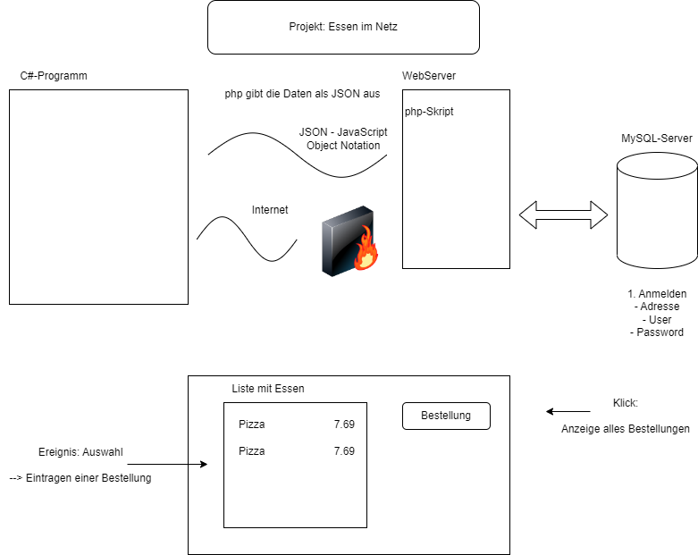
## Ausgabe einer Liste mit Essen vom Server

## MySql
Erstellt wird ein MySql-Server der wie folgt aufgebaut ist.  

+ MySql-Server:
    + Datenbank:    Lieferdienst
    + Tabelle:      Essen 

Es soll einen Nutzer geben, der nur auf diese Datenbank zugreifen darf, er darf nur lesen und eintragen.

### Datenbank erstellen
XAMPP Control Panel starten. --> MySQL Starten --> Shell
1. Starten von MySQL in der Shell:
```SQL 
mysql -u root
```
2. Datenbank erstellen:
+ Create Datenbank:  
 ```SQL 
 create database Essen;
 ```
+ Datenbank benutzen:       
```SQL 
use lieferdienst;
```
3. Tabelle erstellen:  

Die Tabelle essen wird mit folgenden eigenschaften erstellt:  
eid steht für Essen ID. Bekommt einen eigenen einmaligen Wert = auto_increment und wird den Primary Key.  

Die Spalte bezeichnung beinhaltet Text und bekommt den Datentyp varchar mit 50 Zeichen.

Der Preis ist decimal(5,2)
```SQL
MariaDB [lieferdienst]> create table essen (
    -> eid int auto_increment primary key,
    -> bezeichnung varchar(50),
    -> preis decimal(5,2));
```
+ Ausgabe Tabellenbeschreibung:

```SQL
describe essen;
```
+ Screenshoot Ausgabe beschreibung: 


4. Tabelle mit Inhalt befüllen:
```SQL
INSERT INTO essen (bezeichnung, preis,) VALUES ('Dönerteller',10.95,);
```

### User erstellen
+ User Ronny Erstellen:
```SQL
create user ronny@localhost identified by "1234";
```
+ User rechte zuweisen
```SQL
grant select on lieferdienst.essen to ronny@localhost;
```
+ kontrollieren 
    + root abmelden: ``` exit; ```
    + ronny anmelden: ``` mysql -u ronny -p ```

+ Ronny versucht etwas in die Tabelle einzufügen
```SQL
MariaDB [lieferdienst]> insert into essen (bezeichnung, preis) values ("Kartoffelbrei mit zwiebeln", 12.99);
ERROR 1142 (42000): INSERT command denied to user 'ronny'@'localhost' for table 'essen'
```


## Server
1. Apache starten
2. Ordner Prog in Verzeichnis: C:\xampp\htdocs erstellen 

## PHP
In Notepad++ wird ein neues PHP dokument mit folgendem Inhalt erstellt:

```php
<?php
	//Verbindung zur Datenbank
	$db = new mysqli("localhost", "ronny", "1234", "lieferdienst");
	
	//Erstellen SQL
	$sql = "select eid, bezeichnung, preis from essen";
	
	//wir senden die sql an den DB-Server
	//wir erhalten Zeiger an Anfang der Tabelle (vor der 1. Zeile)
	$tabelle = $db->query($sql);
	
	//wir holen die 1. Zeile in der Tabelle
	//fetch_assoc: assoziatives Array für eine Zeile
	//Zuordnung: feld->Wert
	$zeile = $tabelle->fetch_assoc();
	
	//solange noch eine zeile in der Tabelle
	while($zeile == true)
	{
		//Ausgabe der Zeile
		print_r($zeile);
		print("<br/>");
		
		//hohle die nächste Zeile
		$zeile = $tabelle -> fetch_assoc();
	}
	
	//Schließen Verbindung
	$db->close();
```

Zweite Variante:
```php
<?php
	//Verbindung zur Datenbank
	$db = new mysqli("localhost", "ronny", "1234", "lieferdienst");
	
	//Erstellen SQL
	$sql = "select eid, bezeichnung, preis from essen";
	
	//wir senden die sql an den DB-Server
	//wir erhalten Zeiger an Anfang der Tabelle (vor der 1. Zeile)
	$tabelle = $db->query($sql);
	
	//wir holen die 1. Zeile in der Tabelle
	//fetch_assoc: assoziatives Array für eine Zeile
	//Zuordnung: feld->Wert
	$zeile = $tabelle->fetch_assoc();
	
	//solange noch eine zeile in der Tabelle
	while($zeile == true)
	{
		//Ausgabe der Zeile
		print "$zeile[eid] <br/> $zeile[bezeichnung] <br/> $zeile[preis] <br/> <br/>";
		print("<br/>");
		
		//hohle die nächste Zeile
		$zeile = $tabelle -> fetch_assoc();
	}
	
	//Schließen Verbindung
	$db->close();
```
Das PHP Dokument wird als essen.php unter C:\xampp\htdocs\Prog abgespeichert.

### Ausgabe Browser
Zur Kontrolle im Browser folgenden link eingeben:  
http://localhost/prog/essen.php

Aufruf phpMyAdmin:  
http://localhost/phpmyadmin/


Ausgabe im Browser:
```PHP
Array ( [eid] => 1 [bezeichnung] => Pizza Funghi [preis] => 8.89 )
Array ( [eid] => 2 [bezeichnung] => Bulette [preis] => 4.99 )
Array ( [eid] => 3 [bezeichnung] => Gem?sepfanne [preis] => 6.99 )
Array ( [eid] => 4 [bezeichnung] => Creme brulee [preis] => 5.59 )
```

Seitenquelltext im Browser:
```html
Array
(
    [eid] => 1
    [bezeichnung] => Pizza Funghi
    [preis] => 8.89
)
<br/>Array
(
    [eid] => 2
    [bezeichnung] => Bulette
    [preis] => 4.99
)
<br/>Array
(
    [eid] => 3
    [bezeichnung] => Gem?sepfanne
    [preis] => 6.99
)
<br/>Array
(
    [eid] => 4
    [bezeichnung] => Creme brulee
    [preis] => 5.59
)
<br/>
```

### Hinzufügen von json_encode

```php
<?php
	//Verbindung zur Datenbank
	$db = new mysqli("localhost", "ronny", "1234", "lieferdienst");
	
	//Erstellen SQL
	$sql = "select eid, bezeichnung, preis from essen";
	
	//wir senden die sql an den DB-Server
	//wir erhalten Zeiger an Anfang der Tabelle (vor der 1. Zeile)
	$tabelle = $db->query($sql);
	
	//wir holen die 1. Zeile in der Tabelle
	//fetch_assoc: assoziatives Array für eine Zeile
	//Zuordnung: feld->Wert
	$zeile = $tabelle->fetch_assoc();
	
	//wir erstellen ein neues Array
	$daten = array();
	
	//solange noch eine zeile in der Tabelle
	while($zeile == true)
	{
		//wir fügen die Zeile dem Array hinzu
		array_push($daten, $zeile);
		
		//Ausgabe der Zeile
		//print_r($zeile);
		//print("<br/>");
		
		//print "$zeile[eid] <br/> $zeile[bezeichnung] <br/> $zeile[preis] <br/> <br/>";
		
		//hohle die nächste Zeile
		$zeile = $tabelle -> fetch_assoc();
	}
	
	//wir wandeln das Array in eine Zeichenkette - formatierung nach JSON - um
	$text = json_encode($daten);
	
	
	//wir lassen und den text ausgeben
	print $text;

	//Schließen Verbindung
	$db->close();
```

#### Ausgabe json im Browser
Screenshot von: http://localhost/prog/essen.php

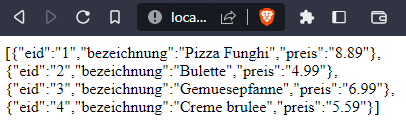
+ Erklärung:  

ein Array/Liste in Eckigen Klammern []  

ein Objekt befindet sich in geschweiften Klammern {}

## HTTP zu JSON
1. Visual Studio: neue Konsolenanwendung TestHttpJASON.cs im Ordner repos erstellen
```C#
static void Main(string[] args)
        {
            //Start einer Asynchronen Methode
            //dieses wird beendet, wenn Main beendet wird
            //Wait() -- Main() muss warten, bis Methode beendet
            Method().Wait();
        }

        //diese Methode soll eine Verbindung zum WebServer herstellen
        //das Php-Skript ausführen
        //Ergebnis ausgeben
        //die Methode wird asynchron (async) ausgeführt -- im Hintergrungn 
        //Task ist eine Aufgabe, die asynchron ausgeführt wird
        static async Task Method()
        {
            //wir brauchen eine Verbindung zum Server
            HttpClient client = new HttpClient();

            //wir bauen eine Verbindung zum php.Skript auf
            //await -- warten auf Ergebnis und speichern in einer Variablen
            var response = await client.GetAsync("http://localhost/prog/essen.php");

            //wenn Verbindung erfolgreich
            if (response.IsSuccessStatusCode)
            {
                //wir holen uns den Inhalt des Datenpakets
                string json = await response.Content.ReadAsStringAsync();
                Console.WriteLine(json);
            }
        }

```

2. Wir fügen eine Klasse mit der Bezeichnung Essen hinzu

```C#
    public class Essen
    {
        public int eid { get; set; }
        public string bezeichnung{ get; set; }
        public double preis { get; set; }

    }
```

3. Newtonsoft.Jason installieren 

Using Newton hinzufügen
```php
using Newtonsoft.Json
```

4. Liste erstellen
```C#
//wir erstellen eine leere Liste
                List<Essen> liste = new List<Essen>();

                //deserialisieren - wir wandeln um den json-string in eine liste von objekten
                //< List<Essen> > --> in den <> den finalen Typ hinschreiben -- was kommt raus
                //wir müssen schon vor der Deserialisierung mitteilen, was Ergebnis ist.
                liste = JsonConvert.DeserializeObject<List<Essen>>(json); 

                foreach(Essen e in liste)
                {
                    Console.WriteLine(e.eid + "|" + e.bezeichnung + "|" + e.preis);
                }
```

Für Später

```C#
        //diese Methode soll eine Verbindung zum WebServer herstellen
        //das Php-Skript ausführen
        //Ergebnis ausgeben
        //die Methode wird asynchron (async) ausgeführt -- im Hintergrungn 
        //Task ist eine Aufgabe, die asynchron ausgeführt wird
        static async Task Method()
        {
            //wir brauchen eine Verbindung zum Server
            HttpClient client = new HttpClient();

            //wir bauen eine Verbindung zum php.Skript auf
            //await -- warten auf Ergebnis und speichern in einer Variablen
            var response = await client.GetAsync("http://localhost/prog/essen.php");

            //wenn Verbindung erfolgreich
            if (response.IsSuccessStatusCode)
            {
                //wir holen uns den Inhalt des Datenpakets
                string json = await response.Content.ReadAsStringAsync();
             
                //wir erstellen eine leere Liste
                List<Essen> liste = new List<Essen>();

                //deserialisieren - wir wandeln um den json-string in eine liste von objekten
                //< List<Essen> > --> in den <> den finalen Typ hinschreiben -- was kommt raus
                //wir müssen schon vor der Deserialisierung mitteilen, was Ergebnis ist.
                liste = JsonConvert.DeserializeObject<List<Essen>>(json); 

                foreach(Essen e in liste)
                {
                    Console.WriteLine(e.eid + "|" + e.bezeichnung + "|" + e.preis);
                }
            }
        }
```
Klasse für Später

```C#
namespace TestHttpJSON
{
    public class Essen
    {
        public int eid { get; set; }
        public string bezeichnung{ get; set; }
        public double preis { get; set; }

    }
}
```


## WPF-Anwendungen für grafische Oberflächen
-- WPF - Windows Presentation Foundation --

Layout: xaml (extensible application markup Language)  

Funktion: C#


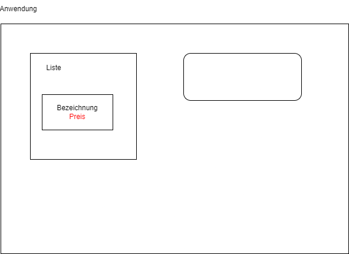


## Neues Projekt

WPF-App(.NET Framework) --> Name: Wpf_Lieferdienst

MainWindow.xaml

Code 
```html
<Window x:Class="Wpf_Lieferdienst.MainWindow"
        xmlns="http://schemas.microsoft.com/winfx/2006/xaml/presentation"
        xmlns:x="http://schemas.microsoft.com/winfx/2006/xaml"
        xmlns:d="http://schemas.microsoft.com/expression/blend/2008"
        xmlns:mc="http://schemas.openxmlformats.org/markup-compatibility/2006"
        xmlns:local="clr-namespace:Wpf_Lieferdienst"
        mc:Ignorable="d"
        Title="Lieferdienst" Height="450" Width="800" Loaded="Window_Loaded">
    <Window.Resources>
        <ResourceDictionary Source="Dictionary1.xaml" />
    </Window.Resources>
    <Grid>
        <!-- mein Fenster wird in 2 Spalten unterteilt -->
        <Grid.ColumnDefinitions>
            <ColumnDefinition Width="60*" />   <!-- 60% der Breite des Fensters -->
            <ColumnDefinition Width="40*" />
        </Grid.ColumnDefinitions>
        <Image Name="img" />
        <!-- in der linken Spalte ist eine Liste | ItemsSource - wir haben im Programm eine Liste mit Daten -->
        <ListView  Grid.Column="0" Name="listView" ItemsSource="{Binding}" >
            <!-- wir legen fest, wie ein objekt angezeigt werden soll -->
            <ListView.ItemTemplate>
                <DataTemplate>
                    <!-- hier steht, wie ein Objekt angezeigt werden soll -->
                    <StackPanel Orientation="Vertical">
                        <Label Content="{Binding bezeichnung}" Style="{StaticResource style2}" />
                        <Label Content="{Binding preis}" Style="{StaticResource style1}" ContentStringFormat="{}{0} €"/>
                        <Label Content="{Binding bemerkung}" FontStyle="Italic" Foreground="DarkGreen" FontFamily="courier new" />
                    </StackPanel>
                </DataTemplate>
            </ListView.ItemTemplate>
        </ListView>
        <Button Grid.Column="1" Content="Anzeige Essen" Click="Button_Click" />
    </Grid>
</Window>

```

## Erweiterung der bestehenden Anwendung

Der bestehenden Datenbank essen soll eine zusätzliche Spalte 'beschreibung' hinzugefügt werden. Es müssen änderungen in der Datenbank, in dem PHP Script und in der C# Anwendung wie folgt vorgenommen werden.

### Datenbank
Angelehnt an die Punkte 1 - 4 im Oberen Abschnitt.

5. Es soll eine Spalte bezeichnung der Tabelle hinzugefügt werden.
+ Spalte bemerkung hinzufügen
```SQL
ALTER TABLE essen ADD bemerkung VARCHAR(250);
```
6. Die Spalte bemerkung soll ebenfells mit Informationen gefüllt werden.
```SQL
UPDATE essen SET bemerkung='kann Spuren von Menschen enthalten' WHERE eid = 3;
```

### Anpassung PHP
+ Anpassung in PHP --> In der PHP datei muss zusätzlich zur Ausgabe der eid und bezeichnung nun auch die bemerkung eingefügt werden. Alternativ zu der anpassung unten würde ebenfalls SELECT * FROM essen; gehen. Allerdings ist aktuell unklar ob in Zukunft alles ausgegeben werden soll. Deshalb:

```PHP
	$sql = "select eid, bezeichnung, preis, bemerkung from essen";
```
### Anpassung C#
+ Anpassung in der MainWindow.xaml 
```
<Label Content="{Binding bemerkung}" Foreground="Green" FontFamily="Verdana" FontSize="14" FontStyle="Italic"/>
```

+ Anpassunng in Essen.cs
```C#
public string bemerkung { get; set; }
```

# Dienstag 16.05.2023
Die bestehende Anwendung soll im Bilder ergäntz werden. Jedes Produkt in der Tabelle essen soll ein entsprechendes Bild bekommen.
## SQL
Der Tabelle essen eine neue Spalte mit dem Namen Bilder hinzufügen.

Die Bilder in: C:\xampp\htdocs\Bilder Gespeichert.

## PHP
Anpassungen in PHP Maskierung von einem \ entfernt.

```php
	//wir wandeln das Array in eine Zeichenkette - formatierung nach JSON - um
	$text = json_encode($daten, JSON_UNESCAPED_SLASHES);
```

und in der SQL Abfrage wird um das bild ergänzt.
```php
	//Erstellen SQL
	$sql = "select eid, bezeichnung, preis, bemerkung, bild from essen";
```

## C#
### Hinzufügen Klasse bild
Die Klasse bild muss hinzugefügt werden:
```C#
        public string bild { get; set; }
```
###

Anpassung in der MainWindow.xaml

```C#
<ListView.ItemTemplate>
                <DataTemplate>
                    <!-- hier steht, wie ein Objekt angezeigt werdne soll -->
                    <StackPanel Orientation="Horizontal"> <!-- Das kommt neu hinzu-->
                        <Image Source="{Binding bild}" Width="100"/> <!-- auch wo das Bild herkommt-->
                        <StackPanel Orientation="Vertical">
                        <Label Content="{Binding bezeichnung}" Style="{StaticResource style2}"/>
                        <Label Content="{Binding preis}" Style="{StaticResource style1}" ContentStringFormat="{}{0} €" />
                        <Label Content="{Binding bemerkung}" Foreground="Green" FontFamily="Verdana" FontSize="14" FontStyle="Italic"/>
                        </StackPanel>
                    </StackPanel>
                </DataTemplate>
            </ListView.ItemTemplate>
```

## Erweiterung der Anwendung -- Bestellung von Essen --

Aktuell sieht das Menu der Anwendung wie folg aus:

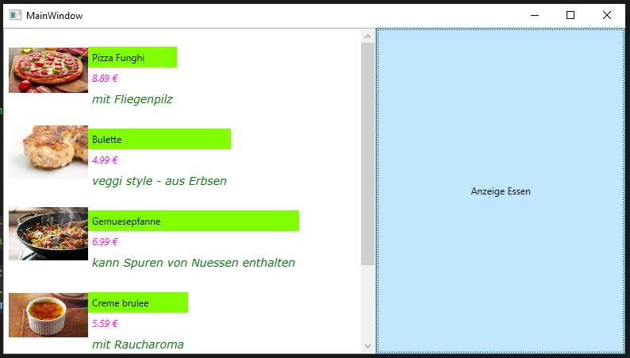

Dem Menu soll ein Ereignis Doub

### SQL
1. Schritt: Datenbank erweitern
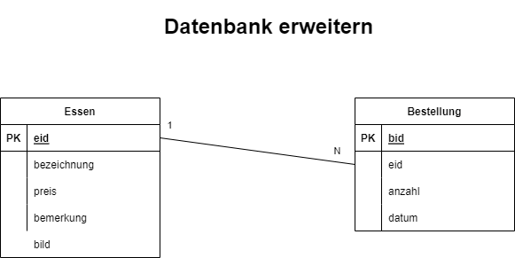

wir erstellen eine Tabelle bestellung
```SQL
create table bestellung(
    -> bid int auto_increment primary key,
    -> datum datetime,
    -> eid int,
    -> anzahl int unsigned,
    -> foreign key (eid) references essen (eid));
```
Beschreibung der Tabelle bestellung:

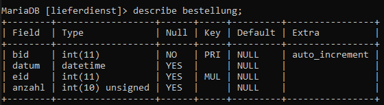

Bestellung hinzufügen:
```SQL
insert into bestellung (datum, eid, anzahl) values (now(), 2, 3);
```
Die Tabelle bestellung Sieht jetzt wie folgt aus:

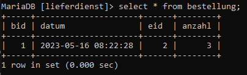

Benutzer Ronny bekommt noch die Rechte für die Tabelle bestellung:

```SQL
grant select on lieferdienst.bestellung to ronny@localhost;
```

### PHP
Datenübertragung von Programm zu Php-Skript: eid, anzahl

Variante1: http://localhost/Prog/bestellen.php?eid=2&anzahl=3 --> Suboptimal, die Daten sind Bestandteil der URL

Variante2: http:localhost/Prog/bestellen.php --> Datenübertragung als Inhalt des Datenpakets

Variante2 wird gewählt. Neues php erstellen und als bestellen.php unter -> C:\xampp\htdocs\Prog abspeichern.

Das Skript sieht wie folgt aus: **Version1**
```PHP
<?php
	//wir legen die Daten, die eingetragen werden fest
	//wir müssen später ergänzen
	$eid = 2;
	$anzahl = 3;
	
	//Verbindung zum Server aufbauen
	$db = new mysqli ("localhost", "ronny", "1234", "lieferdienst");
	
	//für variable Werte in SQL-Anweisungen Platzhaler ? verwenden
	//SQL-Injection
	$sql = "insert into bestellung (datum, eid, anzahl) values (now(), ?, ?)";
	
	//wir senden die SQL an den Server und dieser bereitet diese vor
	$insert = $db->prepare($sql);
	
	//wir legen fest, welche Werte bei den Platzhaltern eingetragen werden
	//dazu gehört auch der Datentyp
	$insert->bind_param("ii",$eid, $anzahl);
	
	//und dann ausführen
	$insert->execute();
	print mysqli_affected_rows($db);

	//Datenbank schließen
	$db->close();
?>
```

Das endgültige PHP-Skript sieht wie folgt aus: **Version2**
```PHP
<?php
	//wir holen uns die Daten aus dem Datenpaket
	$json = file_get_contents('php://input');
	
	//wir wandeln den Json in einen Array um
	$daten = json_decode($json, true);
	
	$eid = $daten["eid"];
	$anzahl = $daten["anzahl"];
	
	//Verbindung zum Server aufbauen
	$db = new mysqli ("localhost", "ronny", "1234", "lieferdienst");
	
	//für variable Werte in SQL-Anweisungen Platzhaler ? verwenden
	//SQL-Injection
	$sql = "insert into bestellung (datum, eid, anzahl) values (now(), ?, ?)";
	
	//wir senden die SQL an den Server und dieser bereitet diese vor
	$insert = $db->prepare($sql);
	
	//wir legen fest, welche Werte bei den Platzhaltern eingetragen werden
	//dazu gehört auch der Datentyp
	$insert->bind_param("ii",$eid, $anzahl);
	
	//und dann ausführen
	$insert->execute();
	print mysqli_affected_rows($db);
	//Datenbank schließen
	$db->close();
?>
```
+ Daten werden aus dem Datenpaket geholt
+ Wir wanden den Json in einen Array um

### C# 
In der MainWindow.xaml wird der Doppelklick hinzugefügt
```html
        <!-- in der linken Spalte ist eine Liste | ItemSource - wir haben im Programm eine Liste mit Daten -->
        <ListView Grid.Column="0" Name ="listView" ItemsSource="{Binding}" MouseDoubleClick="listView_MouseDoubleClick">
```

In die MainWindow.xaml.cs kommt eine Messagebox hinzu sieht aus wie folgendes:

```C#
        private void listView_MouseDoubleClick(object sender, MouseButtonEventArgs e)
        {
            //welches Essen wurde ausgewählt?
            Essen wahl = listView.SelectedValue as Essen;
            MessageBox.Show(wahl.bezeichnung);
        }
```
### Ein neues Fenster
Ein neues Fenster erstellen.  
Projektmappe --> Rechtsklick --> Fenster hinzufügen --> FensterBestellen.xaml wird erstellt.

Bei einem Doppelklick soll sich dieses Fenster öffnen. Die Daten müssen von der Main Window in die FensterBestelln übertragen werden.
Einteilen in Zeilen und Spalten 5 Reihen und 2 Spalten 

In der FensterBestellung.xaml.cs Tragen wir folgendes ein:
```C#
    <Grid>
        <Grid.ColumnDefinitions>
            <ColumnDefinition Width="*" />
            <ColumnDefinition Width="*" />
        </Grid.ColumnDefinitions>
        <Grid.RowDefinitions>
            <RowDefinition Height="40*" />
            <RowDefinition Height="15*" />
            <RowDefinition Height="15*" />
            <RowDefinition Height="15*" />
            <RowDefinition Height="15*" />
        </Grid.RowDefinitions>

        <Image Source="{Binding bild}" Width="300" Grid.ColumnSpan="2" Grid.Row="0" HorizontalAlignment="Center" />
        <Label Content="{Binding bezeichnung}" Grid.ColumnSpan="2" Grid.Row="1" HorizontalAlignment="Center" />
        <Label Content="{Binding preis}" Grid.ColumnSpan="2" Grid.Row="2" HorizontalAlignment="Center" />
        <Label Content="Anzahl" Grid.Column="0" Grid.Row="3" HorizontalAlignment="Right" VerticalAlignment="Center"/>
        <TextBox Name="txtAnzahl" Grid.Column="1" Grid.Row="3" HorizontalAlignment="Left" Width="100" VerticalAlignment="Center" />
        <Button Click="btnCancel_Click" Content="Abbrechen" Name="btnCancel" Grid.Column="0" Grid.Row="4" HorizontalAlignment="Center" VerticalAlignment="Center" Width="150"/>
        <Button Click="btnOk_Click" Content="Bestellen" Name="btnOk" Grid.Column="1" Grid.Row="4" HorizontalAlignment="Center" VerticalAlignment="Center" Width="150"/>
    </Grid>

```
Anschliesend Ist das Fenster Bestellen wir folgt aufgeteilt: 


Die zwei Button Bestellen und Abbrechen bekommen Ihre funktion:

**Abbrechen**
```C#
        private void btnCancel_Click(object sender, RoutedEventArgs e)
        {
            //wir senden an das Hauptfenster, dass der Button "Abbrechen" geklickt wurde
            this.DialogResult = false;
            this.Close();
        }
```

**Bestellung**
```C#
        private async void btnOk_Click(object sender, RoutedEventArgs e)
        {
            //Bestellung in Datenbank eintragen
            //wir erstellen ein neues Objekt mit der eid und der anzahl
            int anzahl = Convert.ToInt32(txtAnzahl.Text);
            
            //wir fassen die eid und die Anzahl zusammen (werden zusammen in einem Datanpaket übertragen)
            var daten = new {wahl.eid, anzahl};

            //wir wandeln um. Das Objekt in einen JSON-String
            string json = JsonConvert.SerializeObject(daten);

            //wir rufen das php-skript auf
            HttpClient client = new HttpClient();
            HttpContent content = new StringContent(json); //StringContent ist Unterklasse von ByteArrayContent
            await client.PostAsync("http://localhost/prog/bestellen.php", content);

            this.DialogResult = true;
            this.Close();
        }
```

## Programmablauf
Programm wird gestartet. Menu sieht wie folgt aus:

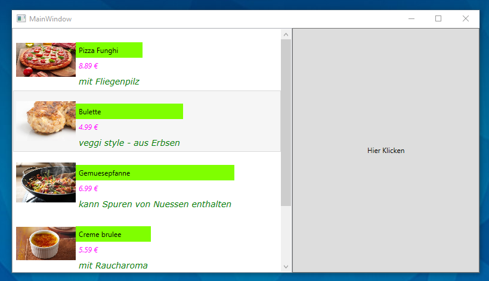

Ein Doppelklick auf ein Produkt öffnet folgendes Fenster:

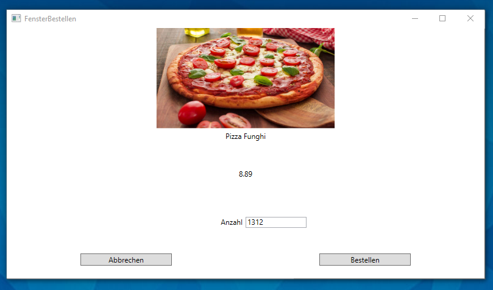

Eine Bestellung von 1312 Pizzen führt nach klicken des Buttons Bestellen zu folgender Ausgabe:

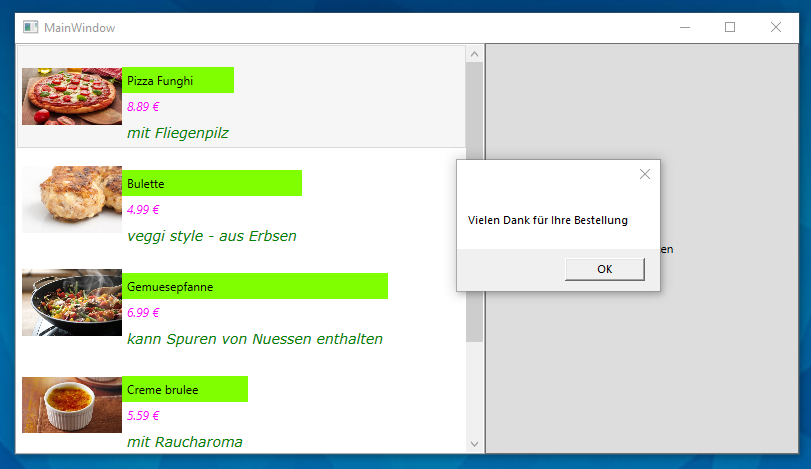


Die aufgegebene Bestellung von 1312 Pizzen wird wie gewünscht in der Tabelle bestellung gespeichert. Siehe:

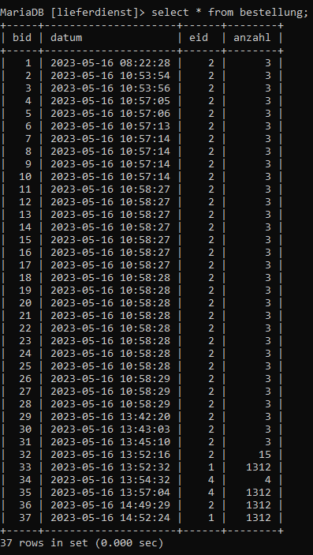