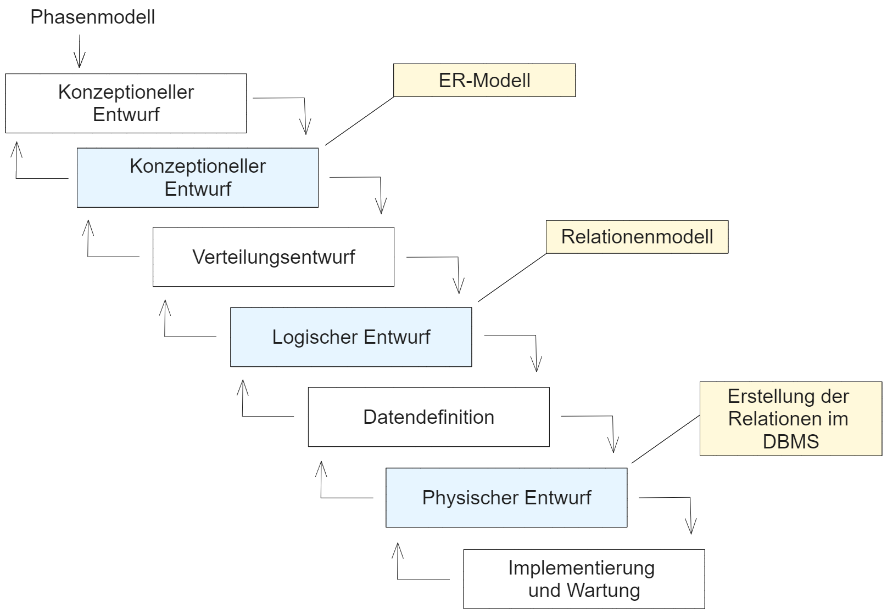
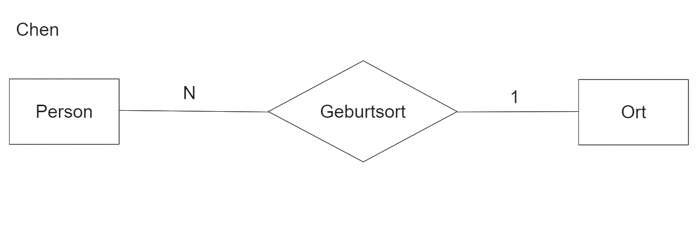
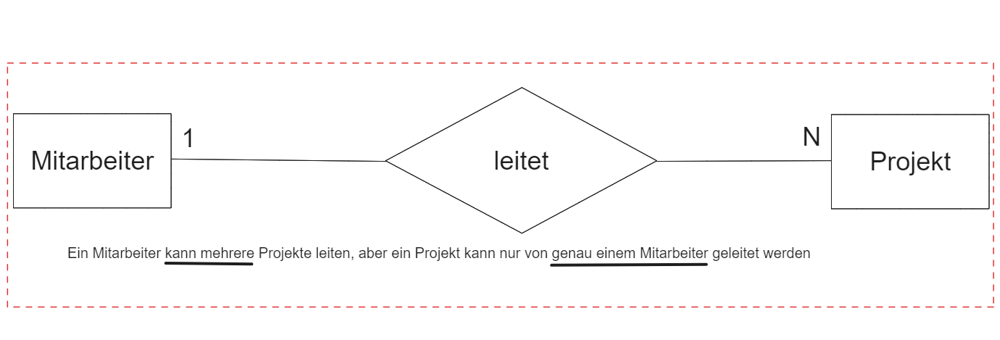

# Datenbank
## Datenbankdesign

## Phasen des Datenbankentwurfs

## Entity Relationship Modell (ER-Modell / ERM)
+ Grundlagen für einen Datenbankentwurf
+ Planung für Aufbau und Funktionen der Datenbankstruktur
+ Standard für die Datenmodellierung
+ Typisierung von Objekten, ihrer relationalen Beziehungen unterienander und der über sie zu führenden Attribute

## Begriffe
|Beschreibung|Typ|Darstellung|
|---|---|---|
|**Entitäten:**individuell identifizierbare Objekte der Wirklichkeit|**Entitätstyp:**Typisierung gleicher Entitären||
|**Beziehungen:** Verknüpfungen/Zusammenhänge zwischen zwei oder mehreren Entitäten|**Beziehungstyp:** Typisierung gleichartiger Beziehungen||
|**Eigenschaften:** Merkmal, Kennzeichen, Informationsdetail, das einem konkreten Objekt zugeordnet ist|**Attribut:** Typisierung gleichartiger Eigenschaften||

## Entity-Relationship-Diagramm (ER-Diagramm)
+ grafische Darstellung von Entitätstypen und Beziehungstypen
+ Vielzahl unterscheidlicher Notationen
+ Beispiel:
    + Chen-Notation von Peter Chen, 1976

## Kardinalitäten
### 1:1
+ Jede Entität aus der ersten Entitätsmenge kann mit **höchstens einer** Entität aus der zweiten Entitätsmenge in Beziehung stehen, und umgekehrt
### 1:n
+ Jede Entität aus der ersten Entitätsmenge kann mit **beliebig vielen** Entitäten aus der zweiten Entitätsmenge in Beziehung stehen. Jede Entität aus der zweiten Entitätsmenge kann mit **höchstens einer** Entität aus der ersten Entitätsmenge in Beziehung stehen
### m:n
+ Jede Entität aus der Ersten Entitätsmenge kann mit **beliebig vielen** Entitäten aus der zweiten Entitätsmenge in Beziehung stehen, und umgekehrt.

## Umsetzung in ein Datenbankschema
+ Erkennen und Zusammenfassen von Entitäten zu Entitätstypen durch Abstraktion
    + Beispiel: Alle Mitarbeiter werden zum Entitätstyp Mitarbeiter Zusammengefasst
+ Erkennen und Zusammenfassen von Beziehungen zwischen je zwei Objekten zu einem Beziehungstyp
+ Bestimmung der Kardinalitäten, d.h. der Häufigkeit des Auftretens

## Überführung in ein relationales Modell
Die Überführung einer Entity-Relationship-Modells in das Relationen-Modell basiert im Wesentlichen auf den folgenden Abbildungen:
+ Entitätstyp -> Relation
+ Beziehungstyp -> Fremdschlüssel
    + im Falle eines n:m-Beziehungstyps -> zusätzliche Relation
+ Attribut -> Attribut

## Zusammenhang relationalem Modell und ER-Modell
|Relationales Modell|Beschreibung|ER-Modell|ER-Diagramm|
|---|---|---|---|
|Relationenname|Name der Tabelle|Name des Entitätstyps|Name im Rechteck|
|Attribut|Spalte einer Tabelle|Attribut|Oval|
|Relationenschema|Menge von Attributen|Entitätstypen|Rechteck mit Ovalen|
|Tupel|Zeile einer Tabelle|Entität|-|
|Relation|Menge von Zeilen|Entitätsmengen|-|

## Transformationsregeln
+ **Regel 1:** Jeder Entitätstyp wird als Tabelle dargestellt. Jede Tabelle benötigt einen Primärschlüssel.
+ **Regel 2:** Jede n:m-Beziehung wird durch eine eigene Tabelle dargestellt.
+ **Regel 3:** Jede 1:n- und 1:1-Beziehung **mit** eigenen Attributen wird wie bei Regel 2 durch eine eigene Tabelle dargestellt.
+ **Regel 4a:** Jede 1:n-Beziehung **ohne** eigene Attribute wird so dargestellt, dass der Primärschlüssel der 1-Entitätstyps Fremdschlüssel des n-Entitätstyps wird
+ **Regel 4b:** Jede 1:1-Beziehung **ohne** eigene Attribute wird so dargstellt, dass der Primärschlüssel des ersten Entitätstyps beim zweiten Entitätstyp Primär- und Fremdschlüssel zugleich wird.
+ **Regel 4c:** Sind Regel 4a oder 4b nicht anwendbar, dann wird für die Beziehung eine gesonderte Tabelle angelegt.