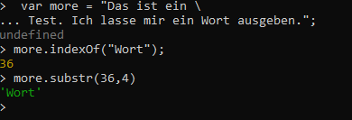

# Vorbereitung für das Specialist JS Zertifikat

## Aufgabe
### IndexOf
Erstellen sie eine VAriable mit einem Mehrzeiligen Text. Überprüfen sie, ob ein bestimmtes Wort in dem Text vorkommt. Lassen sie sich das gefundene Wort zurückgeben.

