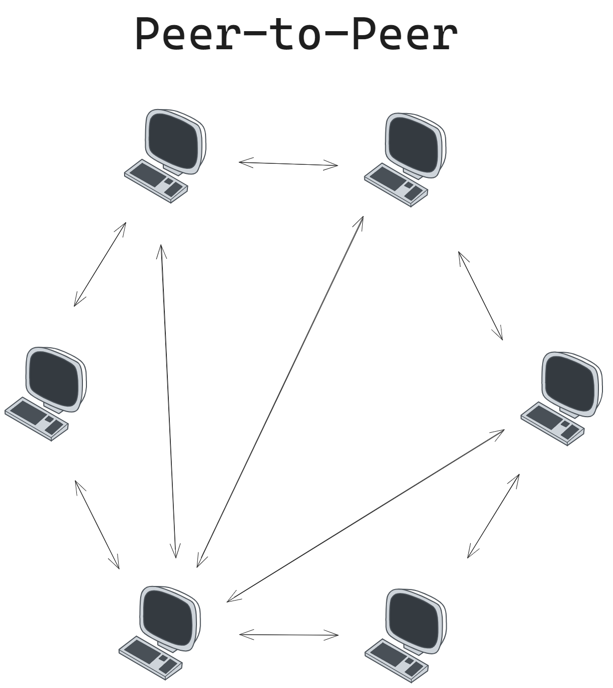
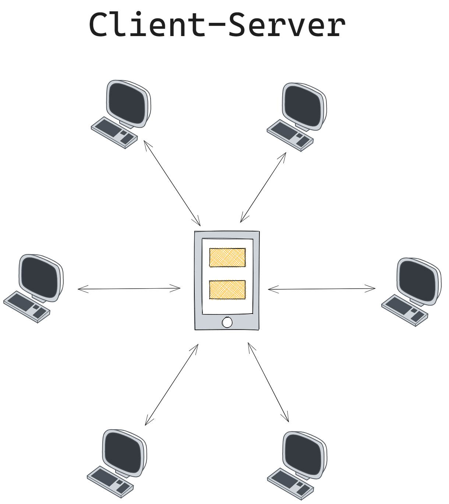

# Netzwerk

## Was ist ein Computer Netzwerk
Ein Computer Netzwerk ist ein Zusammenschluss verschiedener Technischer Geräte ,z.B. Computer, Server, Drucker, Sensoren etc die (mindestens zwei Geräte), die über eine Verbindung (Kabel) miteinender verbunden sind.
+ Informationsaustausch
+ Kommunikation

Netzwerke werden wie folgt unterschieden:

+ **PAN - Personal Area Network**
    + +Reichweite von wenigen Metern. Gleicher Raum. Maximal Nebenraum
    + USB, Fire Wire, Bluetooth
    +  Geringe Bandbreite
    + Hobby und Privatbereich
    + IoT - Internet of Things

+ **LAN - Local Area Network**
    + Mehrere Geräte in einem Verbund
    + Ethernet
    + Netz im eigenen Zuhause oder Standort im Unternehmen

+ WLAN

+ **MAN - Metropolitan Area Network**
    + Verbindet Clients in einem Ballungsraum miteinander
    + Verbindet einzelne LANs über Glasfaserkabeln

+ **WAN - Wide Area Network**
    + mehrere MANs zusammengeschlossen
    + Verbindung über einen größeren Geografische Bereiche wie Länder oder Kontinente
    + Sind meist im Besitz einer bestimmten Organisation oder Unternehmens

+ **GAN - Global Area Network**
    + Weltumspannend -> Internet
    + Umfasst mehrere WANs
    + Nutzt die Glasfaserinfrastruktur von Weitverkehrsnetzen und schließt diese durch internationale Seekabel oder Satelitenübertragung zusammen

## Grundkonzepte der Vernetzung

### Peer-to-Peer

Peer-to_peer 

#### Vorteile Peer-to-Peer
+ Keine extrakosten für Server
+ keine speziellen Betriebssysteme nötig -> gängige PC-Betriebssysteme funktionieren für dieße art der Vernetzung

#### Nachteile Peer-to-Peer

### Client-Server

