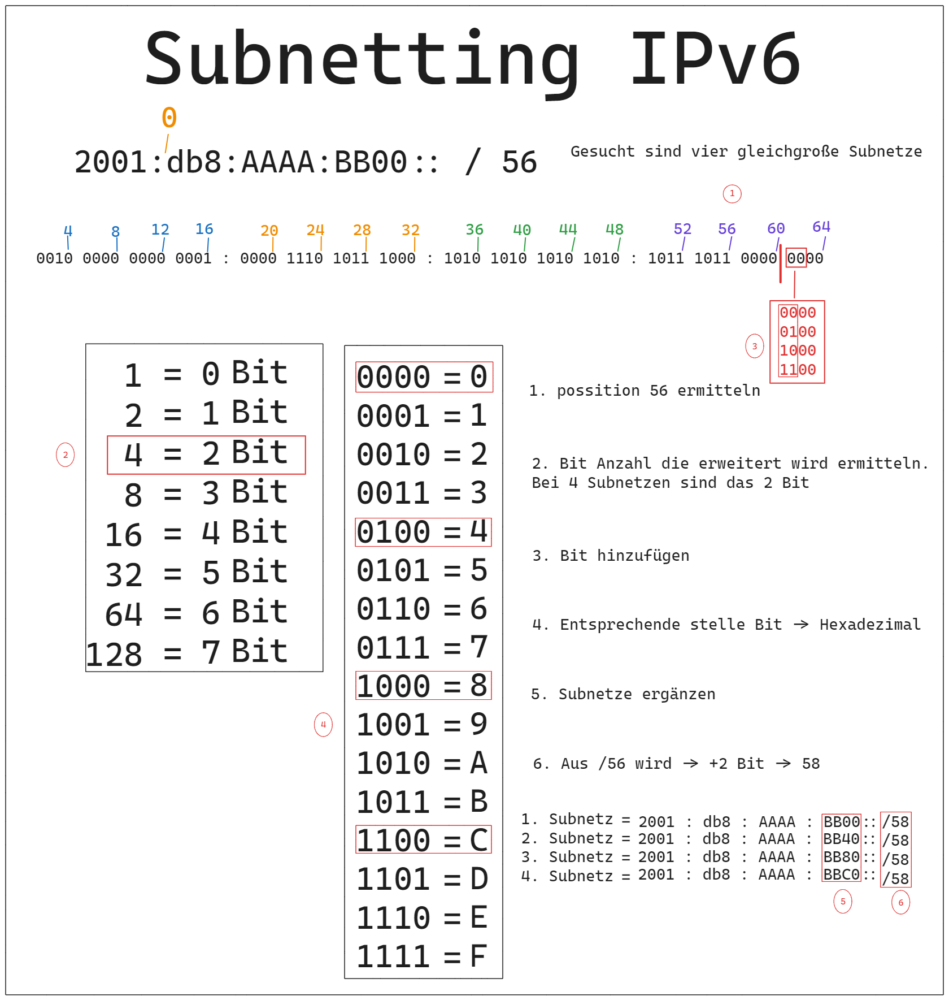

# IP und Subnetting

## IPv4
### Aufbau
+ eine IPv4 Adresse besteht aus 32 bit. Es sind 2^32 maximale IP-Adressen

### privater IP-Bereich
|Bereich|von|bis|als Netzbereich geschrieben|
|---|---|---|---|
|A|10.0.0.0|10.255.255.255||
|B|172.16.0.0|||
|C|192.168.0.0|||

## IPv6

