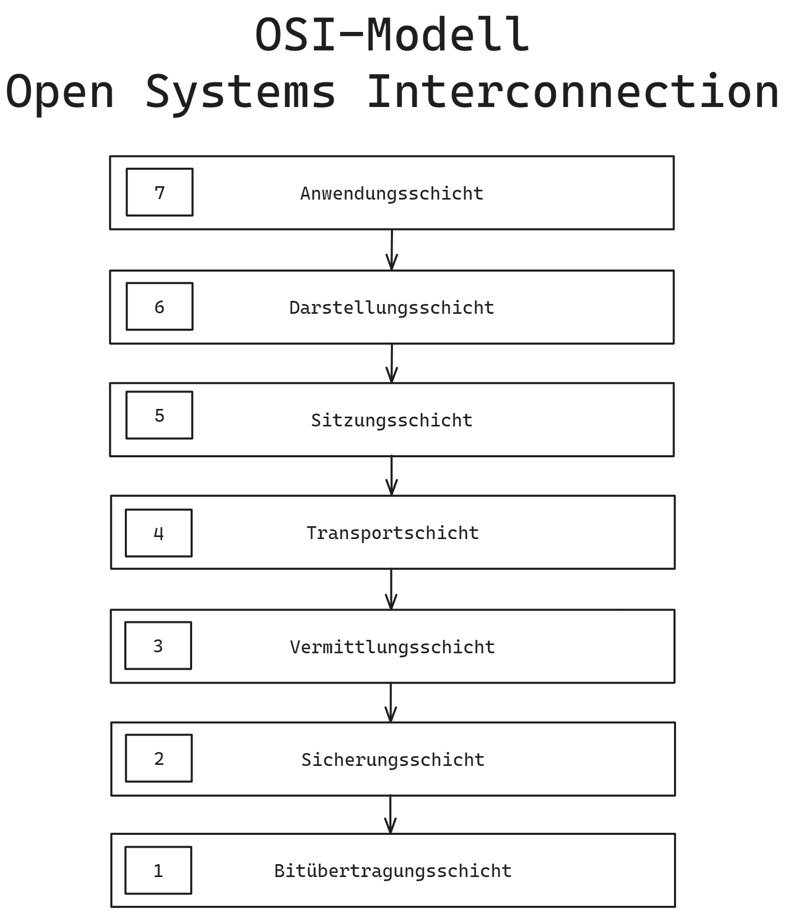

# osi

## OSI - Open Systems Interconnection

### 7. Anwendungsschicht

### 6. Darstellungsschicht

### 5. Sitzungsschicht

### 4. Transportschicht
TCP/UDP

### 3 Vermittlungsschicht

### 2. Sicherungsschicht

### 1. Bitübertragungsschicht

