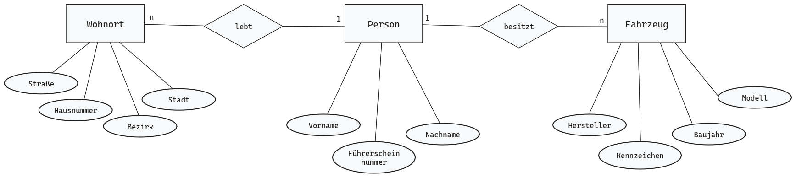
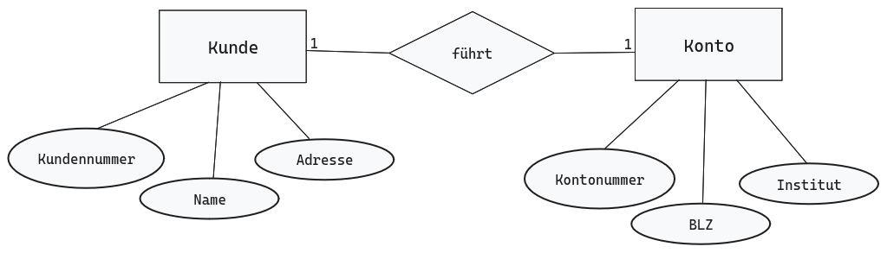
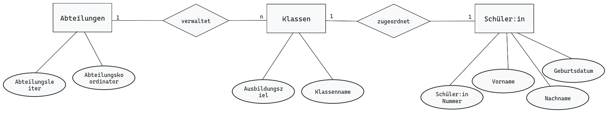
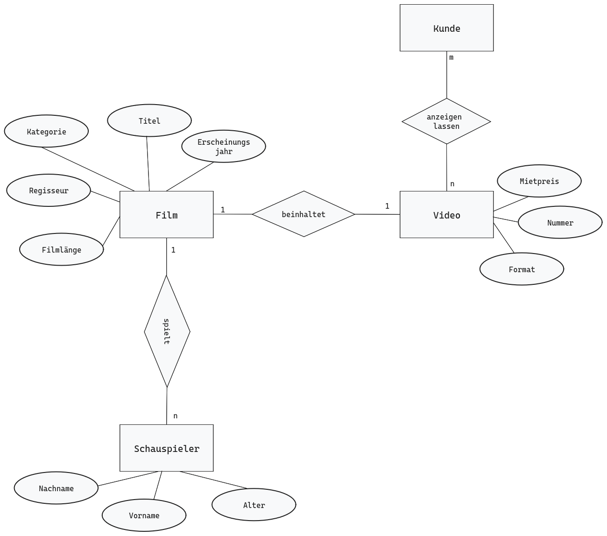

# Datenbank

## Aufgabe 1
### Datenbanksystem (DBS)
+ Ein Datenbanksystem dient zur elektronischen Verwaltung von Informationen.
+ Speichert Daten effizient und strukturiert
+ Ermöglicht es Informationen für eine effiktive Nutzung abzurufen
+ Besteht aus zwei Komponenten
    + Datenbankmanagementsystem
    + Datenbank

### Datenbankmanagementsystem (DBMS)
+ Software um eine Datenbank zu verwalten
+ Organisation und Strukturierung der Daten
+ Über das DBMS können Datenbanken erstellt und bearbeitet werden

### Datenbank (DB)
+ organisierte Sammlung von strukturierten Informationen oder Daten

+ Relationale Datenbanken
    + Daten werden in Tabellen gespeichert
    + Abfrage durch SQL
    + Basis von Business Software
+ Objektorientierte Datenbank
    + Informationen werden in Form von Objekten dargestellt
    + Ideal für die Kombination mit objektorientierter Programmierung
+ NoSQL
    + Speicherung von unstrukturierten und semistrukturierten Daten
    + Für das Management von Big Data geeignet

### Entity-Relationship-Diagramm (ER-Diagramm)
+ Grundlage für einen Datenbankentwurf
+ Planung für Aufbau und Funktionen der Datenbankstruktur
+ Standard für die Datenmodellierung
+ Typisierung von Objekten, ihrer relationalen Beziehungen untereinander und der über sie zu führenden Attribute

|Bezeichnung|Beschreibung|Typ|Darstellung|
|---|---|---|---|
|**Entitäten**|individuell identifizierbare Objekte der Wirklichkeit|**Entitätstyp:** Typisierung gleicher Entitäten||
|**Beziehungen**|Verknüpfungen / Zusammenhänge zwischen zwei oder mehreren Entitäten|**Beziehungstyp:** Typisierung gleichartiger Beziehungen||
|**Eigenschaften / Attribute**|Merkmale, Kennzeichen, informationsdetail, dass einem konkreten Objekt zugeordnet ist|**Attribut:** Typisierung gleichartiger Eigenschaften||

### SQL Structured Query Language

### Datenredundanz
+ Daten liegen Doppelt vor
+ Identische Daten sind an meheren Stellen in einer Tabelle gespeichert
+ Datenredundanz führt dazu, dass Abfragen einer Datenbank falsche Ergebnisse liefern.
+ Die Eindeutigkeit der Datenbankeinträge gehr verloren

### Datenintegrität bzw. Datenkonsistenz
+ Korrektheit, Vollständigkeit und Konsistenz der Daten
    + korrekt
    + einheitlich
    + aktuell

### Datensicherheit
+ Beschreibt die Sicherheit von Daten vor dem Zugriff unbefugter
+ Verschlüsselung
+ Passwörter Hashen
+ Zugangskontrolle

## Aufgabe 2
### Redundanzen
+ In der Tabelle gibt es eine Spalte für Vorname und Nachname und zusätzlich noch mal eine Spalte für Name. Die Spalte Name darf so nicht bestehe da er Redundant sprich doppelt vorkommt. 
### Inkonsistenz
+ Unter der Spalte Name werden Vorname und Nachname gespeichert.
+ Alle Informationen müssen Atomar in einer Tabelle vorliegen

### Datensicherheit
+ Passwörter dürfen niemals  in einer unverschlüsselten Tabelle gespeichert werd
+ Passwörter niemals ohne es zu hashen speichern

## ER-Diagramm Aufgaben
### Aufgabe 1

### Aufgabe 2

### Aufgabe 3

### Aufgabe 4

Gegeben sei die folgende Miniwelt der Krankenhäuser:

+ Es gibt **Krankenhäuser**, die eine eindeutige *Krankenhausnummer* haben, einen *Namen*, eine *Anschrift* und eine *feste Anzahl Betten*.

+ Krankenhäuser beschäftigen **Ärzte**. Diese haben einen *Namen*, eine *Personalnummer*, eine *Adresse* und ein *Fachgebiet*.

+ Ein Arzt betreut mehrere **Patienten**. Ein Patient hat einen *Namen*, ein *Geschlecht*, eine *Adresse*, ein *Geburtsdatum*, eine *Station* und eine *Patientennummer*.

+ Es gibt ausserdem **unabhängige Labore** mit eindeutiger *Labornummer*,*Namen*, *Anschrift* und *Telefonnummer*. Labore werden von Krankenhäusern 
beauftragt.

+ In Laboren werden Tests durchgeführt. Diese Tests haben einen Testcode,einen Typ, einen Status und ein Datum. Tests werden an Proben von Patienten durchgeführt.

+ Krankenhäuser beschäftigen auch Krankenschwestern und Krankenpfleger. Diese haben einen Namen, eine Adresse, ein Geschlecht, eine Station, ein Alter und eine Personalnummer.

+ Die Zimmer eines Krankenhauses haben eine Zimmernummer und eine Bettenzahl.

+ Eine Krankenschwester ist immer für mehrere Zimmer zuständig.

+ Auf jedem Krankenzimmer liegen mehrere Patienten.
Patienten leiden an einer oder mehreren Krankheiten. Eine Krankheit hat einen Namen, Symptome und einen Status.

+ Patienten nehmen mehrere Medikamente. Ein Medikament hat einen Namen, einen Preis, einen Bestand und einen Lieferanten.

+ Modelliere die Krankenhaus-Miniwelt mit Hilfe eines ER-Diagramms.

+ Übertrage anschließend die ER-Modellierung schrittweise in ein relationales Schema.

