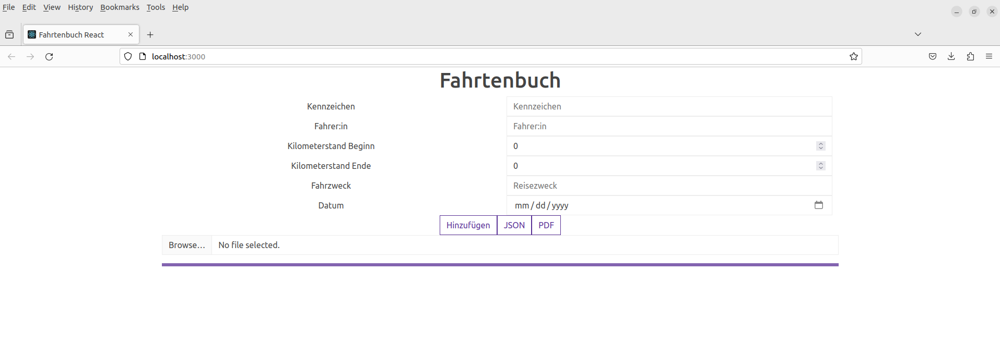

# Fahrtenbuch React App
## Dokumentation
### Anforderung
Erstellen eines Fahrtenbuches mit React. Das Fahrtenbuch soll die Daten im local Storage des Browsers speichern. 
Eingegeben werden sollen folgende Informationen:
+ Kennzeichen des Fahrzeugs
+ Fahrer:in des Fahrzeugs
+ Kilometerstand bei Beginn der Fahrt
+ Kilometerstand bei Ende der Fahrt
+ Datum der Fahrt
+ Zweck der Fahrt

Die eingegebenen Daten sollen nach eingabe in einer Liste unterhalb des Eingabeformulars ausgegeben werden.
Zusätzlich soll das Herunterladen der entstandenen Liste in Form einer JSON Datei möglich sein.
Über die Möglichkeit eines Uploads soll es möglich sein JSON Dateien hochzuladen und den Inhalt ausgeben zu lassen.
Die Einträge der Liste sollen sich nachträglich einzeln löschen lassen.

### GUI
#### Entwurf

Eingabemöglichkeiten des Fahrtenbuchs

Ausgabe der Liste unterhalb der Eingabe

#### Zwischenstand

Zwischenstand Eingabemöglichkeit mit Bootstrap

Zwischenstand Ausgabe der Liste unterhalb der Eingabe

## TODO

### Funktionalität
+ enum Kennzeichen
+ Speichern Kilometer entsprechend zu einem Nummernschild
+ KM Ende wird als neuer KM stand gespeichert
+ + Bei Auswahl Nummernschild anzeige KM-Beginn automatisch aktuellen KM stand

### Download
+ PDF export

### PWA - progressive web app
+ Bedeutet das eine Anwendung eigenschaften einer Native und einer Web App vereint
+ Ermöglicht Plattformunabhängigkeit

1. Download von Chrome
2. Generate a Lighthouse report
3. manifest.jason angepasst
 + https://app-manifest.firebaseapp.com/
4. Icon ausgewählt - Neue Images in passenden größen erstellt - Entsprechende Images hochgeladen und in manifest.jason angepasst
 + https://imageresizer.com/de
5. maskable erstellt und hochgeladen -> manifest.json
 + https://maskable.app/editor
6. `yarn run build`
7. upload build Ordner bei Netlify
  + https://fahrtenbuch.netlify.app/

### 

## zu verstehen
### useEffect

## Erstellen
+ Zuerst wurde die React App generiert.
  `yarn create react-app . --template typescript`
+ App Starten:
  `yarn start`
  Runs the app in the development mode.\
  Open [http://localhost:3000](http://localhost:3000) to view it in the browser.
  
## Dashboard

## Navigation
Um sich innerhalb der App bewegen zu können ist es notwendig die Navigation innerhalb der App zu ermöglichen. Dafür verwendet wurde  wurde react-router-dom 6.20.1
### React-router-dom
+ Installation von react-router-dom
    + `npm install react` 
### Navbar

## Speichern der Daten
### Local Storage

## Bearbeiten

