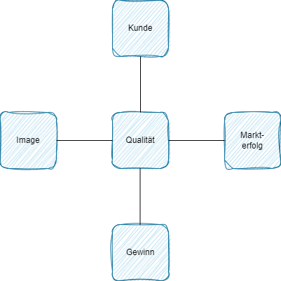
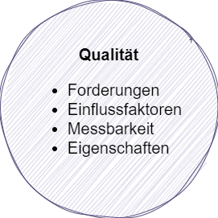
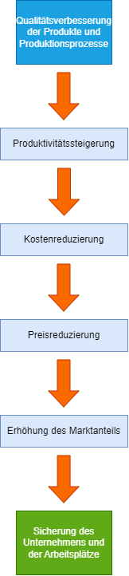
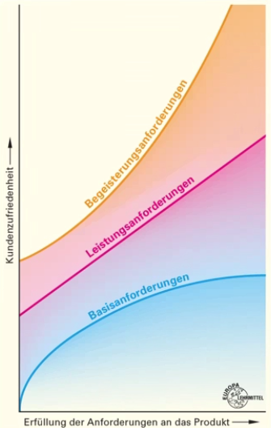
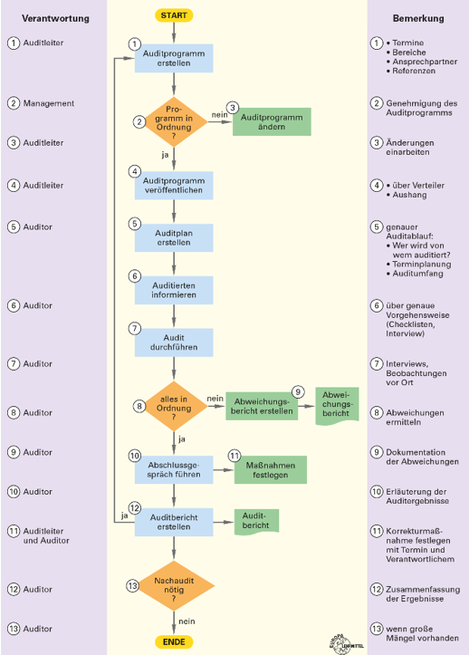

# Qualität
## Qualität
Qualität ist die Beschaffenheit einer Leistung hinsichtlich ihrer Übereinstimmung mit den gestellten Anforderungen von Kunden, vom Markt, vom Gesetzgeber und vom Unternehmer.
### Bedeutung der Qualität

Als Verbraucher haben wir aufgrung eigener Erfahrungen eine Vorstellung von Qualität. Ihre Bedeutung ist für jeden Einzelnen unterschiedlich ausgeprägt.

Trotzdem stellt sich für jeden von uns ein wichtiges Kriterium bei dem Kauf bzw. bei der Verwendung eines Produktes oder der Inanspruchnahme einer Dienstleistung dar.

### Qualität für den Produzenten
Primäres Ziel für den Produzenten ist es, nachhaltige Gewinne zu erwirtschaften. 

Das erforderte Produkt, die den Kunden anforderungen entsprechen, eine hohe Wirtschaftlichkeit des Produktententstehungsprozesses und Beachtung der gesellschaftlichen Rahmenbedingungen.

+ Steigender Konkurrenzdruck durch Globalisierung
    + Schneller Wandel der Informations- und Kommunikationstechniken
    + Veränderungen der Technologien, Forschung und Wissenschaft, Industrie und Infrastrukturen
    + Know-how wird transparenter und zugänglicher
### Qualität und ihre Eigenschaften
 

+ Qualität ist nichts Absolutes
+ Qualität ist keine physikalische Größe
+ Qualität ist kein binärer Begriff

### Normen
Um eindeutige Aussagen über nahezu jegliche vom Menschen geplante Tätigkeiten und daraus resultierende Ergebnisse zu erzielen, werden Begriffe mit eindeutigen Benennungen und Beschreibungen benötigt.

Durch ihre Abstraktion und Festlegung in Normen (technische Normen, Rechtsnormen usw.) wurde eine notwendige Verständigungsgrundlage über die Fachbereiche und Branchen hinweg geschaffen, auf der Tätigkeit/Prozesse/Verfahren und Ergebnisse beschrieben und festgelegt werden können.
+ Abkürzungen
    + DIN   - Deutsches Institut für Normung
    + EN    - European Norm
    + ISO   - International Organization for Standardization
    + IEC   - International Electrotechnical Commission
+ Ziel der Normfamilie DIN ISO 9000
    + Regelung des Verhältnisses zwischen Unternehmen und Kunden
    +    Die Forderungen beziehen sich auf Bereiche, die im Rahmen des Qualitätsmanagementsystems geregelt sein müssen
+ Branchenneutrale Normen
    + DIN EN ISO 9000:2005 Grundlagen und Begriffe
    + DIN EN ISO 9007:2008 Anforderungen
    + DIN EN ISO 9004:2009 Leistungsverbesserung
    + DIN EN ISO 14001:2009 Anforderungen an ein Umweltmanagementsystem
    + DIN EN ISO 190011 Leitfaden zur Auditierung von Managementsystem
### Grundsätze / Leitsätze Qualitätsmanagement
+ Qualitätsbewusste Führung
+ Einbeziehung aller Mitarbeiter
+ Kundenorientierung
+ Stabiles Kunden-Lieferanten-Verhältnis
+ Prozessorientierung
+ Systemorientierter Managementansatz
+ Treffsichere Entscheidungshilfe
+ Ständige Verbesserung

#### European Foundation for Quality Management kurz **EFQM**
+ 1988 als eine gemeinnützige Organisation in Brüssel gegründet
+ Ihr Ziel ist es, die treibende Kraft für nachhaltige Spitzenleistung in Europa zu sein
+ Die Methode orientiert sich an den Grundsätzen für TQM
+ Auszeichnungen mit dem **E**uropean **Q**uality **A**ward (EQA) - **EFQM Exzellente Award**

Excellente Leistung beruht im EFQM-Modell auf folgenden Prinzipien
+ **Ergebnisorientierung** = Alle Hierarchiestufen des Unternehmens stehen hinter den erziehlten Ergebnissen
+ **Führung und Zielkompetenz** = eine fortschritliche Unternehmensführung mit kontinuierlicher Zielsetzung
+ **Kundenausrichtung** = einwandfreie Qualität

### Ökologiemanagement
Der Begriff Ökologiemanagement (ÖM) umfasst die Planung, Steuerung, Überwachung und Verbesserung sowohl der Maßnahmen des betrieblichen Umweltschutzes als auch die Unternehmens- und Mitarbeiterführung unter ökologischen Aspekten. Dabei bilden Qualität, Umweltschutz und Sicherheit einen stetigen Kreislauf.

#### Umweltpolitische Prinzipien
+ **Verursacherprinzip** - die Kosten der Umweltbelastung werden dem Verursacher angelastet - der Urheber trägt die Kosten für die Beseitigung
+ **Vorsorgeprinzip** - ökologische Risiken werden bekämpft bevor die entstanden sind.
+ **Vorsichtprinzip** - ist eine Verschärfung des Vorsorgeprinzips. Im Falle eines Mangels an gesicherter Risikoabschätzung kann es zu Verboten kommen.
+ **Substitutionsprinzip** - Gefahrenstoffe werden durch umweltfreundliche Stoffe ersetzt, sofern ein Ersatzstoff vorhanden ist.
+ **Integrationsprinzip** - zeigt die Verknüpfung von Umweltproblemen mit den verschiedenen Politikbereichen.
+ **Kooperationsprinzip** - die Durchsetzung von umweltpolitischen Maßnahmen soll durch die Abstimmung zwischen Behörden, gesellschaftlichen Gruppen und Partnern gesichert werden.

### Ökologisch Wirtschaften
Beim ÖM genießt die Vermeidung der Ressourcenverschwndung, sowohl ökologisch wie auch ökonomisch höchste Priorität.

Einen wichtigen Teil bildet dabei der Wunsch nach Materialeinsparungen sowohl bei der Produktgestalltung als auch bei der innerbetrieblichen Konstruktion der Aufbau- und Ablaufkonstruktion.
## Einführung eines QM-Systems
### Strategie zur Einführung eines QM-Systems
Abhängig von:
+ Größe des Unternehmens und seiner Struktur
+ Unternehmensprozessen
+ Vom vorgegebenen Zeitrahmen
+ Von den sich daraus ergebenden Veränderungsprojekten
### Projektphasen
|Projektphasen|Arbeitspakete|
|---|---|
|Vorbereitungsphase|Projektplanung: Abgrenzung, Zuständigkeit, Termine, Kapazität, Kosten, ...|
|Ziele definieren|Qualitätspolitik und -ziele definieren: Kommunikation der Ziele, Einführungsveranstaltungen für Mitarbeiter|
|Istaufnahme|Beschreibung der betrieblichen Abläufe: Prozesse, Fehler, Kosten ...|
|Abweichungsanalyse|Soll-Ist-Vergleich: Schwachstellenanalyse, Optimierung, Normen|
|Festlegung des QM-Systems|Beschreibung des QM-Systems: QM-Handbuch, Prozess, Anweisungen ...|
|Umsetzung der Maßnahmen|Umsetzung der im QM-System festgelegten Maßnahmen|
|Validierung|Umsetzung der im QM-Systems: Interne Audits, Reports, ...|
|Zertifizierungsvorbereitung|QM-System: zertifizierer, Mitarbeiter, Dokumentation, Korrekturmaßnahmen|
|Zertifizierung|Auditierung des QM-System|

### Ablauf der Zertifizierung
+ Erstinformationen über den Zertifizierer &darr;
    + Leistungsspektrum
    + Angebot kalkulieren
    + Auftragserteilung / Vertrag
+ Systemanalyse &darr;
    + Vorbereitung des QM-Systems
    + Prüfung und Beurteilung der QM-System-Dokumentation
    + Erläuterung von erkannten Schwachstellen
    + Erstellung und Abstimmung des Zeitplanes für das Zertifizierungsaudit
+ Voraudit &darr;
    + Beurteilung gemeinsam festlegender Bereich / Prozesse
    + Kurzbericht, Handlungsbedarf und Verbesserungspotenziale aufzeigen
+ Zertifizierungsaudit &darr;
    + Umfassende Prüfung und Bewertung des QM-Systems
    + Auditbereich: Feststellung von Abweichungen
    + Korrekturmaßnahmen durch das Unternehmen
    + Erteilung des Zertifikates nach positiver Entscheidung
+ Zertifikatserteilung
### Verbesserung der Qualität

### Kano Modell

### Audit Ablaufplan

##### Typische Fragen
+ Wozu dient ein Audit?  
In einem Untersuchungsverfahren in dem Anforderungen abgeglichen werden, inwieweit diese erfüllt werden.
Ziel für Auditoren ist schließlich die Überprüfung der Einhaltung der zugrunde liegenden Norm Anforderungen.
+ Welche Auditarten kennen Sie?  
Voraudit, Systemaudit, Prozessaudit, Produktaudit, Compliance Audit
+ Ist das ISO-Zertifikat unbegrenzt gültig?  
Nein. Es ist 3 Jahre gültig
+ Auf welcher Idee basiert TQM?  
Qualität orientiert sich am Kunden. Qualität wird mit Mitarbeitern aller Bereiche und Ebenen erzielt. Qualität umfasst mehrere Dimensionen, die durch Kriterien operationalisiert werden müssen. Qualität ist kein Ziel, sondern ein Prozess, der nie zu Ende ist.
+ Sind Normen rechtlich bindend?  
Die Anwendung von Normen ist grundsätzlich freiwillig. Normen sind nicht bindend, das unterscheidet sie von Gesetzen. Rechtsverbindlichkeit erlangen Normen, wenn Gesetze oder Rechtsverordnungen wie zum Beispiel EU-Richtlinien auf sie verweisen.
+ Erläutern Sie die Ziele der Normung  
