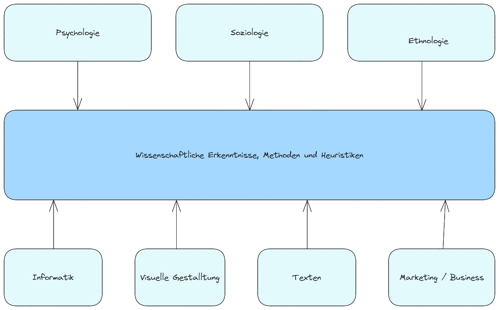

# Benutzeroberflächen

## Zertifizierung
+ Certified Usability Professional CPUX
    + Internationale Zerzifizierung für UX-Professionals
    + Vermittelt Kentnisse in Benutzerzentrierung, Usability-Methoden und UX-Designerprinzipien
+ Certified User Experience Professional CUXP
    + Vom UXQB angebotene Zertifizierung
    + Umfasst Module wie User Requirements Engineering, Usability Evaluation und User Interface Design
+ Certified Professional for Usability ans User Experience CPUX-UX
    + Spezielle Zertifizierung für UX-Professionals
    + Deckt Bereiche wie Benutzerzentrierung, UX-Methoden, User Interface Desig, User Research und Usability Testing ab
+ Interaction Design Foundation (IDF) Zertifizierung
    + Verschiedene Zertifizierungen im Bereich UX und UI
    + Enthalten Themen wie Design Thinking, User Research, Visual Design und Interaction Design

## Wichtige Begriffe
|Begriff|Erklärung|
|---|---|
|Ergonomie||
|Software-Ergonomie||
|Usability||
|Gebrauchstauglichkeit||
|Benutzerfreundlichkeit||
|User Experience UX, Nutzererlebnis||
|Nutzerzentrierte Entwicklung||
|Usability-Engineering||

## Benötigte Kentnisse zu Usability und zur Experience

## Anforderungsanalyse - Requirements Engineering
Die Anforderungsanalyse isz der Prozess des
+ Herausfinden (Elicitation)
+ Analysierens (Analysis)
+ Dokumentierens (Specification)
+ Überprüfens (Validation)  
der Anforderungen.

Anforderungen dienen als Grundlage für:
+ Kommunikation
+ Ermittlung von Rationalisierungspotenzialen
+ Ausschreibung und Vertragsgestaltung
+ Systemarchitektur
+ Test und Abnahme
+ Systemintegration und Wartung
+ fehlerbehebung und Weiterentwicklung
+ Erhöhung der Mitarbeiterzufriedenheit

## Software-Ergonomie
### Die 10 Heuristiken für das Interface Design - nach Jakob Nielsen
+ Sichtbarkeit des Systemstatus - Was macht das Gerät?
    + Das System sollte jederzeit klarmachen, was es gerade macht. JEde Aktion sollte sofort eine Reaktion zeigen
+ Übereinstimmung von System und Realität des Nutzers
+ Kontrolle durch den Nutzer
+ Konsistenz und Standards
+ Fehlervermeidung
+ Selbsterklärung vor Erinnerung
+ Flexibilität und Effizienz
+ Ästhetisches und minimalistisches Design
+ Hilfe beim Erkennen, Diagnostizieren und Beheben von Fehlern
+ Hilfe und Dokumentation

### Software-Ergonomie
Entstand aus der (Hardware)-Ergonomie, die mit der gesundheitsschonenden Gestalltung von Arbeitsplätzen sich beschäftigt. Software-Ergonomie hat das Ziel Software zu entwickeln, die aufgabenangemessen, nützlich und gut benutzbar ist. Weitere Ziele:
+ Leichte Erlernbarkeit
+ Selbsterklärungsfähigkeit
+ Hohe Effizienz bei routinemäßiger Nutzung
+ Minimierung bei Bedienungsfehlern

Die Vermeidung und Behebung dieser Probleme ist kein Luxus, sondern oft die Voraussetzung, um die Erreichung angestrebten ökonomischen Ziele
+ Kostenersparnis
+ Qualitätsverbesserung
+ Entlastung der Anwender

Software-Ergonomie arbeitet mit den Arbeitswissenschaften zusammen, für die Bewertung der rechnergestützten Arbeitsplätze. Dabei geht es darum körperliche Auswirkungen z.B. auf Augen und Handgelenk und psychische Auswirkungen zu analysieren.

