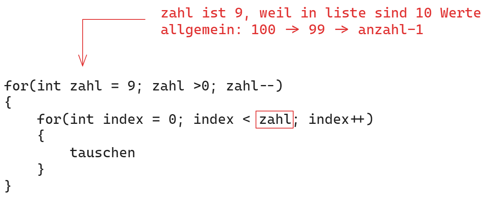

# Algorithmen
## Algorithmus zum Suchen in einer Liste

### iterativ - Lineare Suche
```java
	//Funktion gibt es nur einmal und ist unabhängig von anderen Daten
	//Übergabe: die Liste mit werten, was wird gesucht
	//Rückgabe: index des gesuchten Elements /wenn nicht gefunden, dann -1
	public static int Linear(List<Integer> liste, int suche)
	{
		int index = -1;		//index nicht gefunden
		
		int anzahl = liste.size();
		for(int i = 0; i<anzahl; i ++)
		{
			if(liste.get(i) == suche)
			{
				index = i;
				break;
			}
		}
		return index;
	}
```

### rekursiv Binäre Suche
```java
	//Funktion für binäre Suche / Iterativ
	//Übergabe: linke Grenze, rechte Grenze, gesucht Wert
	//Rückgabe: index des gesuchten Wertes / wenn nicht gefunden, dann -1
	public static int Binaer(List<Integer> liste, int linke, int rechte, int suche)
	{
		if(linke==rechte)
		{
			if(liste.get(linke) == suche)
			{
				return linke;
			}
			else
			{
				return -1;
			}
		}

		//Mitte berechnen
		int mitte = (linke + rechte) / 2;
		
		//Prüfe, ob gefunden
		if(liste.get(mitte) == suche)
		{
			return mitte;
		}
		else if(suche < liste.get(mitte))
		{
			return Binaer(liste, linke, mitte-1, suche);
		}
		else
		{
			return Binaer(liste, mitte+1, rechte,  suche);
		}
	}
```

## Sortieren mit Bubble Sort - iterativer Algorithmus
+ 1. Runde
    + von index = 0 ... 9 --> tauschen
+ 2. Runde
    + von index = 0 ... 8 --> tauschen
+ 3. Runde
    + von index = 0 ... 7 --> tauschen
+ 4. Runde
    + von index = 0 ... 6 --> tauschen
+ 5. Runde
    + von index = 0 ... 5 --> tauschen
+ 6. Runde
    + von index = 0 ... 4 --> tauschen
+ 7. Runde
    + von index = 0 ... 3 --> tauschen
+ 8. Runde
    + von index = 0 ... 2 --> tauschen
+ 9. Runde
    + von index = 0 ... 1 --> tauschen



### Code Bubble Sort
```java
public static void BubbleSort(List<Integer> liste)
	{
		int anzahl = liste.size();
		
		for(int zahl = anzahl -1; zahl > 0; zahl--)
		{
			for(int index = 0; index < zahl; index++)
			{
				if(liste.get(index) > liste.get(index+1))
				{
					int temp = liste.get(index);
					liste.set(index, liste.get(index+1));
					liste.set(index+1,  temp);
				}
			}
		}
	}
```

### Unit-Test Bubble Sort
```java
@Test
	void testBubble() {
		List<Integer> liste = new ArrayList<Integer>();
		liste.add(23);
		liste.add(12);
		liste.add(99);
		liste.add(67);
		
		List<Integer> erwartet = new ArrayList<>();
		erwartet.add(12);
		erwartet.add(23);
		erwartet.add(67);
		erwartet.add(99);
		
		Sort.BubbleSort(liste);
		
		Assert.assertEquals(liste,  erwartet);
	}
```

## Rechnen
### Maxi
```java
	public static int Maxi(List<Integer> liste)
	{
		// [1, 2, 3, 9 ,3 ]
		int maxi = Integer.MIN_VALUE;
		
		for (int current: liste)
		{
			if(maxi < current)
			{
				maxi = current;
			}
		}
		return maxi;
	}
```

### Mini
```java
	public static int Mini(List<Integer> liste)
	{
		// [23, 12, 99, 67 ]
		int mini = Integer.MAX_VALUE;
		
		for (int current: liste)
		{
			if(mini > current)
			{
				mini = current;
			}
		}
		return mini;
	}
```

### Avg
```java
```


