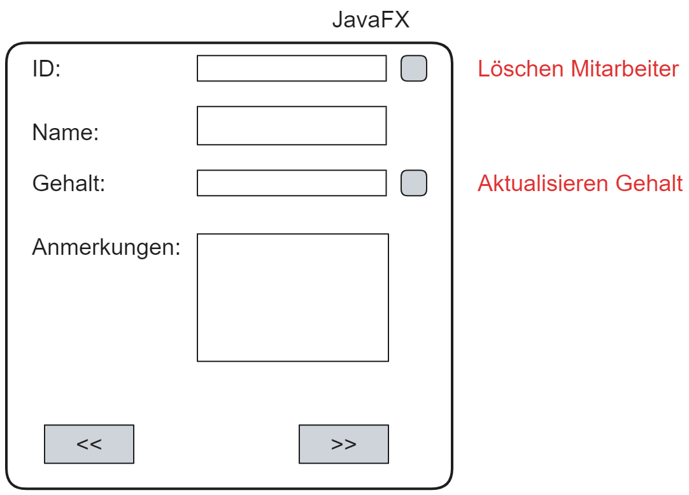

# Java-projekt
## Entwurf


## Anforderung
SQl-Datenbank
+ Erstellen einer Datenbank personal
+ Erstellen einer Tabelle Mitarbeiter
    + id als Primärschlüssel
    + nachname varchar(50)
    + gehalt decimal(6,2)
    + anmerkung varchar(200)
+ Eintragen von 5 Datensätzen     

## SQL-Datenbank
### SQL loggen
+ erstellt eine Datei im angegebenen Pfad
+ loggt die Anweisungen

```sql
tee c:/dateien/log_personal.sql
```

### Erstellen der Datenbank
```sql
create database personal;
```
### Benutzen der Datenbank
```sql
use database personal;
```
### Erstellen Tabelle Mitarbeiter
```sql
create table mitarbeiter;
```
### Werte festlegen
```sql
create table Mitarbeiter( id int auto_increment primary key, nachname varchar(50), gehalt decimal(6,2), anmerkung varchar(200));
```
### Tabelle beschreiben lassen
```sql
describe mitarbeiter;
```
### Datensätze eintragen
```sql
insert into mitarbeiter (nachname, gehalt, anmerkung) values ("Berger", 4950.20, "Statistiker");
```
### Alles anzeigen lassen
```sql
select * from mitarbeiter;
```

### Anmerkung
```sql
set autocommit = 0;
```

+ Rückgängig machen

```sql
rollback;
```
```sql
set autocommit = 1;
```

## PHP
### Ordner erstellen
+ Erstellen eines Ordners Personal in -> C:/xampp/htdocs/personal
+ für jede Funktion brauchen wir 1 Php-Skript

### get all
```php
<?php
//Verbinden zum Server - Datenbank personal
$conny = new mysqli("localhost", "root", "" , "personal");

//SQL erstellen
$sql = "select * from mitarbeiter";

//Statement erstellen
$stmt = $conny->query($sql);

//Stmt ausführen und Speichern ResultSet
$zeile = $stmt->fetch_assoc();

//wir erstellen ein Array
$daten = array();

while($zeile ==true)
{
	array_push($daten, $zeile);
	
	$zeile = $stmt->fetch_assoc();
}

$conny->close();

$json = json_encode($daten);
print $json;

//1. Zeile holen
//Solange zeile != null
	//Zeile dem Array $daten hinzufügen
	//nächste Zeile holen
//array in einen json-Text umwandeln
//Datenbank schließen
//Ausgabe $json-Text
?>
```

### Update

```php
<?php
//Daten abholen mit $_REQUEST
$id = $_REQUEST["id"];
$gehalt = $_REQUEST["gehalt"];

//Verbinden zum Server - Datenbank personal
$conny = new mysqli("localhost", "root", "" , "personal");

//SQL
$sql = "update mitarbeiter set gehalt = ? where id = ?";

//SQL preparieren
$stmt = $conny->prepare($sql);

//Parameter festlegen
$stmt->bind_param("di", $gehalt, $id);

//Ausführen statement
$stmt->execute();

//Ausgabe wie viele Zeilen betroffen
print $conny->affected_rows;

//Datenbank schließen

?>
```

### Löschen
```php
<?php
//Daten abholen mit $_REQUEST
$id = $_REQUEST["id"];

//Verbinden zum Server - Datenbank personal
$conny = new mysqli("localhost", "root", "" , "personal");

//SQL
$sql = "delete from mitarbeiter where id = ?";

//SQL preparieren
$stmt = $conny->prepare($sql);

//Parameter festlegen
$stmt->bind_param("i", $id);

//Ausführen statement
$stmt->execute();

//Ausgabe wie viele Zeilen betroffen
print $conny->affected_rows;

//Datenbank schließen

?>
```

## Java
## Projekt erstellen
+ neues JavaProject in Oracle  -> ConsolePersonal
+ zwei packages erstellen 
    + personal
    + test
+ Class erstellen personal -> Mitarbeiter


## Mitarbeiter
```java
package personal;

public class Mitarbeiter {
	//Eigenschaften
	public int id;
	public String nachname;
	public double gehalt;
	public String anmerkung;
	
	//Konstruktor
	public Mitarbeiter(int id, String nachname, double gehalt, String anmerkung) {
		super();
		this.id = id;
		this.nachname = nachname;
		this.gehalt = gehalt;
		this.anmerkung = anmerkung;
	}

	//Getter und Setter
	public int getId() {
		return id;
	}

	public void setId(int id) {
		this.id = id;
	}

	public String getNachname() {
		return nachname;
	}

	public void setNachname(String nachname) {
		this.nachname = nachname;
	}

	public double getGehalt() {
		return gehalt;
	}

	public void setGehalt(double gehalt) {
		this.gehalt = gehalt;
	}

	public String getAnmerkung() {
		return anmerkung;
	}

	public void setAnmerkung(String anmerkung) {
		this.anmerkung = anmerkung;
	}

	//Überschreiben to String
	@Override
	public String toString() {
		return "Mitarbeiter [id=" + id + ", nachname=" + nachname + ", gehalt=" + gehalt + ", anmerkung=" + anmerkung
				+ "]";
	}

}
```


