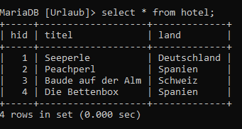
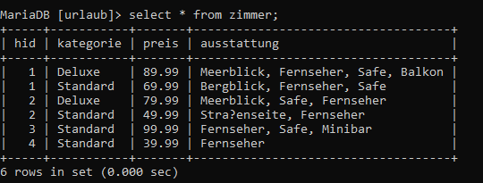
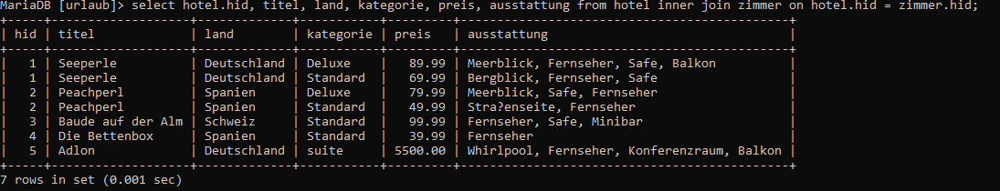
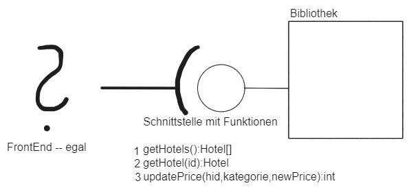

# Urlaub
## SQL
### Datenbank erstellen
```sql
create database Urlaub;
```

### Tabellen erstellen
#### Tabelle hotel
```sql
create table hotel( hid int auto_increment primary key, titel varchar(50), land varchar(50));
```

#### Tabelle zimmer
```sql
create table zimmer( hid int, kategorie varchar(50), preis decimal(6,2), ausstattung varchar(200), primary key (hid, kategorie));
```

### Fremdschlüssel hinzufügen
+ referenzielle Integrität
+ Ich darf in tabelle zimmer nur hid eintragen, die in tabelle Hotel sind (Fremdschlüssel). Wird Hotel gelöscht, wird auch das Zimmer gelöscht
+ wenn hid in hotel update, dann auch Zimmer update
```sql
alter table zimmer add foreign key (hid) references hotel(hid) on delete cascade on update cascade;
```

### Daten eintragen
#### Tabelle Hotel
```sql
insert into hotel (titel, land) values ("Seeperle", "Deutschland");
```
#### Datensatz
|titel|land|
|---|---|
|Seeperle|Deutschland|
|Peachperl|Spanien|
|Baude auf der Alm|Schweiz|
|Die Bettenbox|Spanien|

#### alles Tabelle Hotel
```sql
select * from hotel;
```


#### Tabelle Zimmer
```sql
insert into zimmer values (1, "Standard", 69.99, "Bergblick, Fernseher, Safe");
```

#### Datensatz
|hid|kategorie|preis|ausstattung|
|---|---|---|---|
|1|Deluxe|89.99|Meerblick, Fernseher, Safe, Balkon|
|1|Standard|69.99|Bergblick, Fernseher, Safe|
|2|Deluxe|79.99|Meerblick, Fernseher, Safe|
|2|Standard|49.99|Straßenseite, Fernseher|
|3|Standard|99.99|Fernseher, Safe, Minibar|
|4|Standard|39.99|Fernseher|

#### alles Tabelle Zimmer
```sql
select * from zimmer;
```


### Änderungen
#### Eintragen neues Hotel
+ Was brauchen wir?
    + Name
    + Land
+ Was ist Rückgabe?
    + eine Zahl (rows affected)

```sql
 insert into hotel (titel, land) values ("Adlon", "Deutschland");
```
#### Eintragen neues Zimmer
+ Was brauchen wir?
    + hid
    + kategorie
    + preis
    + ausstattung
+ Was ist Rückgabe?
    + eine Zahl

```sql
insert into zimmer (hid, kategorie, preis, ausstattung) values (5, "suite", 129.99, "Whirlpool, Fernseher, Konferenzraum, Balkon");
```

#### Aktualisieren Preis
+ Was brauchen wir?
    + hid
    + kategorie
+ Was ist Rückgabe?
    + eine Zahl

```sql
update zimmer set preis = 5500 where hid=5 and kategorie="suite";
```

#### Ausgabe alles Hotels
+ Was wir brauchen?
    + nix
+ Was ist Rückgabe?
    + eine Tabelle

```sql
select hid, titel, land from hotel;
```

#### Ausgabe aller Hotels inkl. Zimmer
+ Was brauchen wir?
    + nix
+ Was ist Rückgabe?
    + Tabelle

```sql
select hotel.hid, titel, land, kategorie, preis, ausstattung from hotel inner join zimmer on hotel.hid = zimmer.hid;
```


#### Ausgabe Hotel mit Suche nach Land
+ Was brauchen wir?
    + land
+ Was ist Rückgabe?
    + tabelle
    + hid 
    + titel 
    + land 

```sql
select hid, titel, land from hotel where land="Deutschland";
```

#### Ausgabe des Hotels mit einer ID
+ Was brauchen wir?
    + id
+ Was ist Rückgabe?
    + tabelle
    + hid 
    + titel 
    + land 

```sql
select hid titel, titel, land from hotel where hid = 3;
```

#### Ausgabe aller Hotels mit Name
+ Was brauchen wir?
    + name
+ Was ist Rückgabe?
    + tabelle 
    + hid
    + titel
    + kand

```sql
select hid, titel, land from hotel where titel like "%ad%";
```

#### Ausgabe aller Hotels mit einer Ausstattung
+ Was wir brauchen?
    + die Ausstattung
+ Was ist Rückgabe?
    + hid 
    + titel 
    + land 
    + kategorie 
    + preis 
    + ausstattung

```sql
select hotel.hid, titel, land, kategorie, preis, ausstattung from hotel inner join zimmer on hotel.hid = zimmer.hid where ausstattung like"%safe%";
```

## Schnittstelle


## Java
+ Erstellen Projekt ConsoleUrlaub
+ Paket test
+ Paket urlaub
    + Klasse Hotel
    + Klasse Zimmer

### Klasse Hotel
+ private int hid
+ private String titel
+ private String land

```java
package urlaub;

public class Hotel {
	private int hid;
	private String titel;
	private String land;
	
	public Hotel(int hid, String titel, String land) {
		super();
		this.hid = hid;
		this.titel = titel;
		this.land = land;
	}

	public int getHid() {
		return hid;
	}

	public void setHid(int hid) {
		this.hid = hid;
	}

	public String getTitel() {
		return titel;
	}

	public void setTitel(String titel) {
		this.titel = titel;
	}

	public String getLand() {
		return land;
	}

	public void setLand(String land) {
		this.land = land;
	}

	@Override
	public String toString() {
		return "Hotel [hid=" + hid + ", titel=" + titel + ", land=" + land + "]";
	}
}
```
### Klasse Zimmer
```java
package urlaub;

public class Zimmer {
	private int hid;
	private String kategorie;
	private double preis;
	private String ausstattung;
	
	public Zimmer(int hid, String kategorie, double preis, String ausstattung) {
		super();
		this.hid = hid;
		this.kategorie = kategorie;
		this.preis = preis;
		this.ausstattung = ausstattung;
	}

	public int getHid() {
		return hid;
	}

	public void setHid(int hid) {
		this.hid = hid;
	}

	public String getKategorie() {
		return kategorie;
	}

	public void setKategorie(String kategorie) {
		this.kategorie = kategorie;
	}

	public double getPreis() {
		return preis;
	}

	public void setPreis(double preis) {
		this.preis = preis;
	}

	public String getAusstattung() {
		return ausstattung;
	}

	public void setAusstattung(String ausstattung) {
		this.ausstattung = ausstattung;
	}

	@Override
	public String toString() {
		return "Zimmer [hid=" + hid + ", kategorie=" + kategorie + ", preis=" + preis + ", ausstattung=" + ausstattung
				+ "]";
	}
}
```

### Klasse Hotzi
```java
package urlaub;

public class Hotzi {
	
	private int hid;
	private String titel;
	private String land;
	private String kategorie;
	private double preis;
	private String ausstattung;
	
	public Hotzi(int hid, String titel, String land, String kategorie, double preis, String ausstattung) {
		super();
		this.hid = hid;
		this.titel = titel;
		this.land = land;
		this.kategorie = kategorie;
		this.preis = preis;
		this.ausstattung = ausstattung;
	}

	public int getHid() {
		return hid;
	}

	public void setHid(int hid) {
		this.hid = hid;
	}

	public String getTitel() {
		return titel;
	}

	public void setTitel(String titel) {
		this.titel = titel;
	}

	public String getLand() {
		return land;
	}

	public void setLand(String land) {
		this.land = land;
	}

	public String getKategorie() {
		return kategorie;
	}

	public void setKategorie(String kategorie) {
		this.kategorie = kategorie;
	}

	public double getPreis() {
		return preis;
	}

	public void setPreis(double preis) {
		this.preis = preis;
	}

	public String getAusstattung() {
		return ausstattung;
	}

	public void setAusstattung(String ausstattung) {
		this.ausstattung = ausstattung;
	}

	@Override
	public String toString() {
		return "Hotzi [hid=" + hid + ", titel=" + titel + ", land=" + land + ", kategorie=" + kategorie + ", preis="
				+ preis + ", ausstattung=" + ausstattung + "]";
	}
}
```
### Klasse Schnitti - Schnittstelle

```java
package urlaub;

import java.sql.Connection;
import java.sql.DriverManager;
import java.sql.PreparedStatement;
import java.sql.ResultSet;
import java.sql.SQLException;
import java.sql.Statement;
import java.util.ArrayList;

public class Schnitti {
	
	private static String url = "jdbc:mysql://localhost:3306/urlaub";
	private static String user = "root";
	private static String pwd = "";
	
	private static ArrayList<Hotel> getSelect(String sql) throws SQLException
	{

		ArrayList<Hotel> liste = new ArrayList<>();
		Connection conny = DriverManager.getConnection(url, user, pwd);
		
		Statement stmt = conny.createStatement();
		ResultSet set = stmt.executeQuery(sql);
		
		while(set.next())
		{
			liste.add( new Hotel(set.getInt(1), set.getString(2), set.getString(3)));
		}
		set.close();
		conny.close();
		return liste;	
		
	}
	
	
	private static ArrayList<Hotel> getSelectPrepare(String sql, String text) throws SQLException
	{

		ArrayList<Hotel> liste = new ArrayList<>();
		Connection conny = DriverManager.getConnection(url, user, pwd);
		
		PreparedStatement stmt = conny.prepareStatement(sql);
		stmt.setString(1, text);
		
		ResultSet set = stmt.executeQuery();
		
		while(set.next())
		{
			liste.add( new Hotel(set.getInt(1), set.getString(2), set.getString(3)));
		}
		set.close();
		conny.close();
		return liste;
		
	}
	
	
	
	
	
	public static ArrayList<Hotel> getAll() throws SQLException
	{
		return getSelect("select hid, titel, land from hotel");
	}
	
	public static Hotel getId(int id) throws SQLException
	{
		ArrayList<Hotel> erg = getSelect("select hid, titel, land from hotel where hid = " + id);
		//wenn id gefunden 
		if(erg.size()== 1)
		{
			return erg.get(0);
		}
		else
		{
			return null;
		}
	}
	
	public static ArrayList<Hotel> getLand(String land) throws SQLException
	{
		return getSelectPrepare("select hid, titel, land from hotel where land =?", land );
	}
	
	
	public static ArrayList<Hotel> getName(String titel) throws SQLException
	{
		return getSelectPrepare("select hid, titel, land from hotel where titel like?","%"+titel+"%");
	}
	
	//----------------------------------------------------------------------------------------------------------------------------
	private static ArrayList<Hotzi> getSelectHotzi(String sql) throws SQLException
	{

		ArrayList<Hotzi> liste = new ArrayList<>();
		Connection conny = DriverManager.getConnection(url, user, pwd);
		
		Statement stmt = conny.createStatement();
		ResultSet set = stmt.executeQuery(sql);
		
		while(set.next())
		{
			liste.add( new Hotzi(set.getInt(1), set.getString(2), set.getString(3), set.getString(4), set.getDouble(5), set.getString(6)));
		}
		set.close();
		conny.close();
		return liste;
		
	}
	
	
	
	public static ArrayList<Hotzi> getGesamt() throws SQLException
	{
		//Ausgabe alles Hotels inkl. Zimmer
		return getSelectHotzi("select hotel.hid, titel, land, kategorie, preis, ausstattung from hotel inner join zimmer on hotel.hid = zimmer.hid");
	}
	
	public static ArrayList<Hotzi> getAusstattung(String was) throws SQLException
	{
		//Ausgabe aller Hotels mit einer Ausstattung 
		ArrayList<Hotzi> liste = new ArrayList<>();
		Connection conny = DriverManager.getConnection(url, user, pwd);
		String sql = "select hotel.hid, titel, land, kategorie, preis, ausstattung from hotel inner join zimmer on hotel.hid = zimmer.hid where ausstattung like?";
		PreparedStatement stmt = conny.prepareStatement(sql);
		stmt.setString(1, "%"+was+"%");
		ResultSet  set = stmt.executeQuery();
		while(set.next())
		{
			liste.add( new Hotzi(set.getInt("hid"), set.getString("titel"), set.getString("land"), set.getString("kategorie"), set.getDouble("preis"), set.getString("ausstattung")));
		}
		set.close();
		conny.close();
		return liste;
	}
	
	
	
	
	
	
	
	
	
	/* public static ArrayList<Hotel> getAll() throws SQLException
	{
		ArrayList<Hotel> liste = new ArrayList<>();
		Connection conny = DriverManager.getConnection(url, user, pwd);
		
		String sql = "select hid, titel, land, land from hotel";
		
		Statement stmt = conny.createStatement();
		ResultSet set = stmt.executeQuery(sql);
		
		while(set.next())
		{
			liste.add( new Hotel(set.getInt(1), set.getString(2), set.getString(3)));
		}
		set.close();
		conny.close();
		return liste;
	}
	
	/*public static Hotel getID(int id)
	{
		ArrayList<Hotel> liste = new ArrayList<>();
		Connection conny = DriverManager.getConnection(url, user, pwd);
		
		String sql = "select hid, titel, land, land from hotel where id =" + id;
		
		Statement stmt = conny.createStatement();
		ResultSet set = stmt.executeQuery(sql);
		
		while(set.next())
		{
			liste.add( new Hotel(set.getInt(1), set.getString(2), set.getString(3)));
		}
		set.close();
		conny.close();
		return liste;
	}
	*/
}
```

### Klasse Programm -Main
```java
package test;
import java.sql.SQLException;

import urlaub.*;
public class Programm {

	public static void main(String[] args) throws SQLException {
		// TODO Auto-generated method stub
		
		for (Hotel h:Schnitti.getAll()) 
		{
			System.out.println(h);
		}
		
		System.out.println("----------");
		
		System.out.println(Schnitti.getId(1));
		System.out.println(Schnitti.getId(11));
		
		System.out.println("----------");
		
		for(Hotel h: Schnitti.getLand("Spanien"))
		{
			System.out.println(h);
		}
		
		System.out.println("----------");
		
		for(Hotel h: Schnitti.getName("Per"))
		{
			System.out.println(h);
		}
		
		System.out.println("----------");
		for(Hotzi h: Schnitti.getGesamt())
		{
			System.out.println(h);
		}
		
		System.out.println("----------");
		

		for(Hotzi h: Schnitti.getAusstattung("Safe"))
		{
			System.out.println(h);
		}	
	}
}

```

## FinalUrlaub
### Erstellen
+ Importieren Lib 

+ JSP File -> alleHotels.jsp

### Treiber für SQL-Server laden
```java
protected void doGet(HttpServletRequest request, HttpServletResponse response) throws ServletException, IOException {
		// TODO Auto-generated method stub
		//response.getWriter().append("Served at: ").append(request.getContextPath());
		
		//Wir müssen den Treiber für den MySQL-Server laden
		try {
			Class.forName("com.mysql.jdbc.Driver");
			ArrayList<Hotel> alle = Schnitti.getAll();
			
			if(alle.size() >0)
			{
				request.setAttribute("liste", alle);
				request.getRequestDispatcher("/alleHotels.jsp").forward(request, response);
			}
			else
			{
				response.getWriter().append("keine Hotels vorhanden :(");
			}
			
		} catch (ClassNotFoundException e) {
			// TODO Auto-generated catch block
			response.getWriter().append("Treiber nicht gefunden").append(e.getMessage());
		} catch (SQLException e) {
			// TODO Auto-generated catch block
			response.getWriter().append("Fehler in SQL: ").append(e.getMessage());
		} 
	}
```


