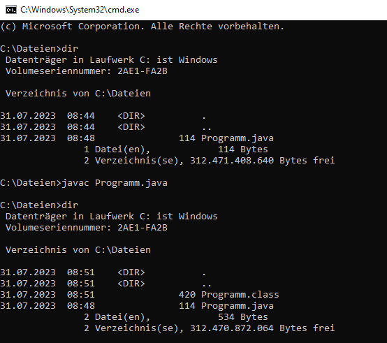
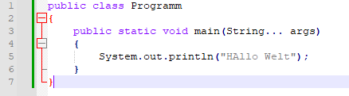

# JAVA

## Programme
- eclipse
- XAMPP
- SzeneBuilder
- jdk Java development kit
    - enthalten: java-API
    - enthalten: Compiler
    - linker
- cmd -> javac

## cmd

+ Compilieren über die Eingabeaufforderung


## JAVA 
- Notepad++


```java
public class Programm
{
	public static void main(String... args)
	{
		System.out.println("Hallo Welt");
	}
}
```

Alles in einer Klasse -> Klasse öffentlich